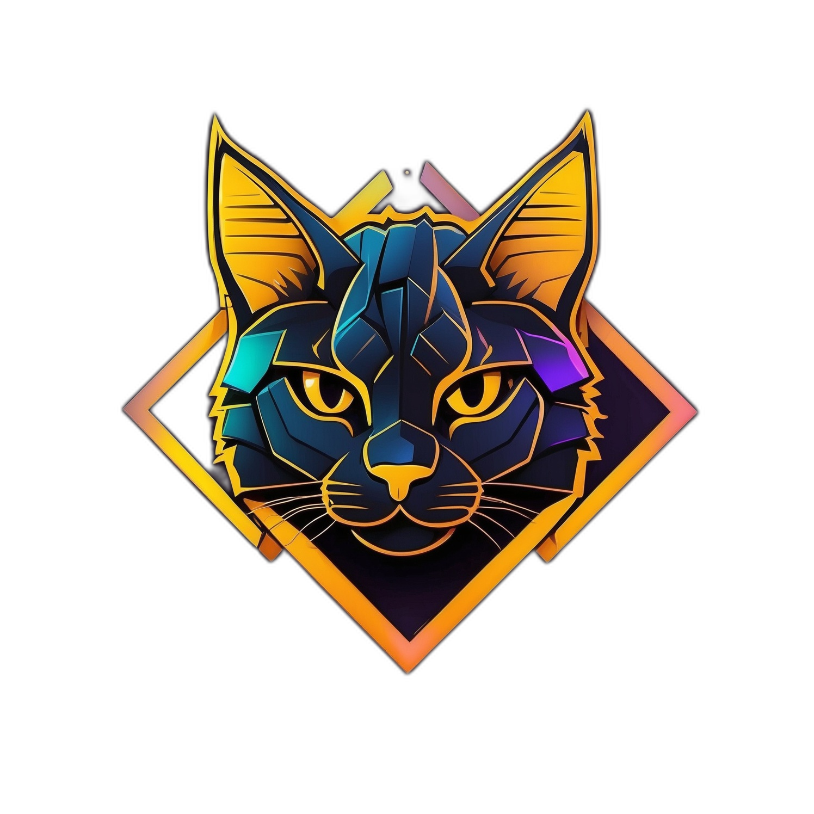
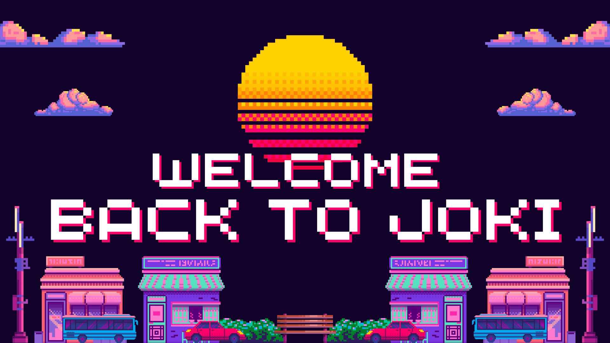
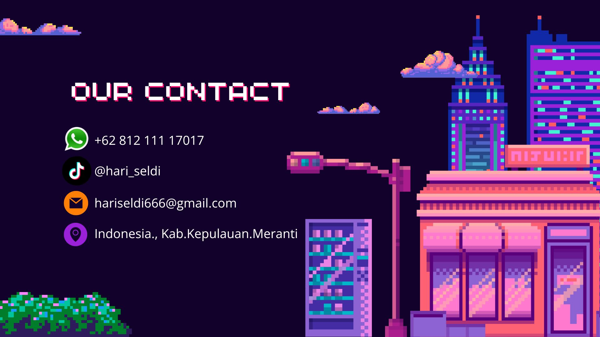

# hari_seldi

<html lang="en">
<head>
    <meta charset="UTF-8">
    <meta name="viewport" content="width=device-width, initial-scale=1.0">
    <title>Hari Joki Mobile Legends</title>
    <link href="https://fonts.googleapis.com/css2?family=Roboto:wght@400;700&family=Poppins:wght@400;700&display=swap" rel="stylesheet">
    <link rel="stylesheet" href="https://cdnjs.cloudflare.com/ajax/libs/font-awesome/6.0.0-beta3/css/all.min.css">
    
</head>
<body>
    <nav class="navbar">
        

            
        

        

            <a onclick="showContent('home')">Beranda</a>
            <a onclick="showContent('services')">Paket Joki</a>
            <a onclick="showContent('contact')">Kontak</a>
        

    </nav>

    <section class="content" id="home">
        <h1>Hari Joki Mobile Legends</h1>
        
        
Selamat datang di jasa joki Mobile Legends. Dapatkan layanan joki terbaik dengan harga terjangkau!

        <a href="#" class="button" onclick="showContent('services')">Lihat Paket Joki</a>
    </section>

    <section class="content" id="services">
        <h2>Paket Joki</h2>
        
        

            <h3>Paket Legend</h3>
            
Naikkan rank Anda ke Legend dengan cepat dan aman.

        

        

            <h3>Paket Mythic</h3>
            
Jadilah yang terbaik dengan layanan joki ke rank Mythic.

        

        

            <h3>Paket Star</h3>
            
Nikmati layanan joki sepanjang season dengan harga spesial.

        

    </section>

    <section class="content" id="contact">
        <h2>Kontak</h2>
        
        
Hubungi kami melalui email di <a href="mailto:hariseldi666@gmail.com"><i class="fas fa-envelope"></i> hariseldi@gmail.com</a> atau melalui telepon/WhatsApp di <a href="tel:+6281211117017"><i class="fas fa-phone-alt"></i> +62 812 111 17017</a>. Kami siap membantu Anda kapan saja.

    </section>

    <footer class="footer">
        
&copy; 2024 Hari Joki Mobile Legends. All Rights Reserved.

    </footer>

    
</body>
</html>
